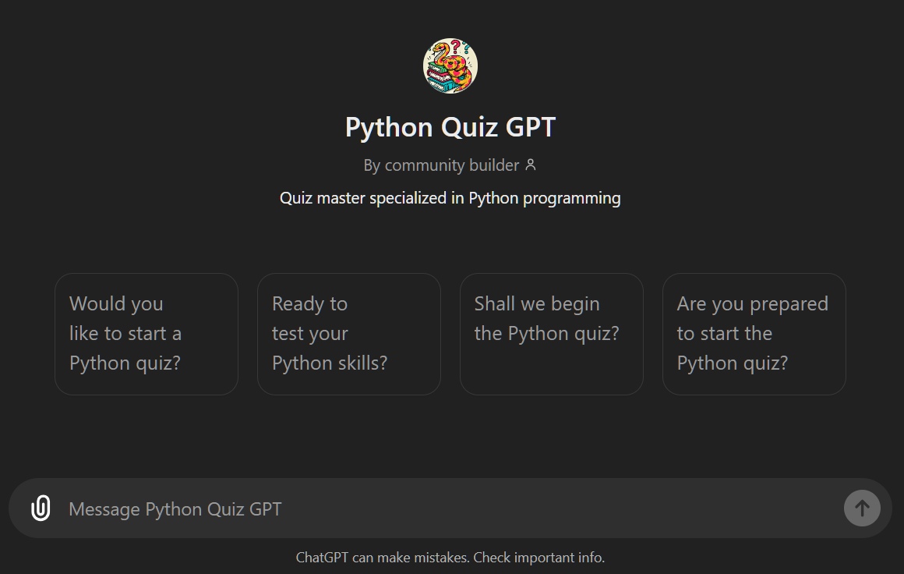

# Panaversity FAQ GPT

We have to build GPT like this:

https://chatgpt.com/g/g-GvTZitpXD-panaversity-faq-gpt

The Documents that we will use in this GPT in the first 13 steps in this repo and the detailed Syllabus of Panaversity:

https://docs.google.com/document/d/15usu1hkrrRLRjcq_3nCTT-0ljEcgiC44iSdvdqrCprk/edit?usp=sharing

## Steps to Create a Custom Python Quiz GPT

1. **Access the GPT Builder:** Navigate to the GPT builder through two options:

   - Visit [https://help.openai.com/en/articles/8554397-creating-a-gpt](https://help.openai.com/en/articles/8554397-creating-a-gpt) directly.
   - If you're already logged in to ChatGPT, click on your username and then select "My GPTs". There, you'll find the option to "Create a GPT".

2. **Interact with the GPT Builder:** The GPT Builder uses a conversational interface. Briefly describe the purpose of your custom GPT.
   In our case, it will be `The purpose of this Python Quiz GPT is to assist students by providing help and Learning source about Python with the help of Quiz.`

3. **Provide Core Details (Create Tab):**

   - **Name and Description:** Python Quiz GPT.

4. **Configure Your GPT (Configure Tab):** This tab allows for further customization. Here's what you can adjust:
   - **Profile Picture:** Upload python Image/Logo.
5. **Prepare Documents**

- **Syllabus Details**: Upload the syllabus details PDF.
- **Python Fundamentals**: Upload the Python fundamentals PDF.

6. **Convert GitHub Repositories to PDFs**
   Use the `git_to_pdf_converter` code to convert relevant GitHub repositories into PDFs. This code is provided in this repository and can be used locally with Docker and Poetry.

7. **Upload Documents**
   Once the PDFs are generated, upload them to your custom GPT. Ensure that the GPT is configured to prioritize information from these documents.

8. **_Configure GPT Instructions_**
   Provide proper instructions to your custom GPT as follows:

- Document Priority
- Avoid Hallucination
- Avoid Irrelevant Information

9. **Test Your GPT**: Test your GPT with a few questions to ensure it's
   working as expected.
10. **Refine Your GPT**: Based on the test results, refine your GPT by
    adjusting the configuration and instructions as needed.
11. **Share Your GPT**: Once you're satisfied with your GPT, share it with
    your students or colleagues.

The full instructions for the GPT are included in the instructions.txt file in this directory.

([Python Quiz GPT]("https://chatgpt.com/g/g-D2WCRHyYC-python-quiz-gpt"))
