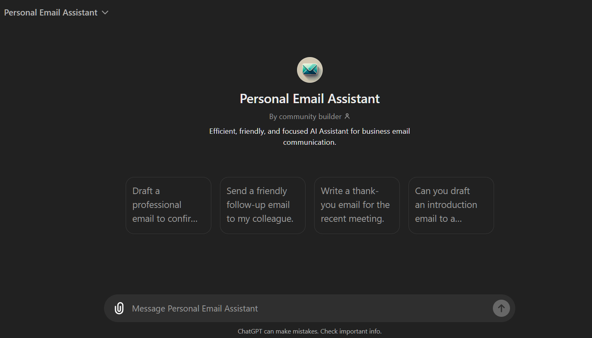

# Personal Email Assistant

We have to build GPT like this:

https://www.youtube.com/watch?v=rJ9IhYeYH1U&t=1188s

## Steps to Create a Personal Email Assistant Custom GPT.

1. **Access the GPT Builder:** Navigate to the GPT builder through two options:

   - Visit [https://help.openai.com/en/articles/8554397-creating-a-gpt](https://help.openai.com/en/articles/8554397-creating-a-gpt) directly.
   - If you're already logged in to ChatGPT, click on your username and then select "My GPTs". There, you'll find the option to "Create a GPT".

2. **Interact with the GPT Builder:** The GPT Builder uses a conversational interface. Briefly describe the purpose of your custom GPT.
   In our case, it will be `The purpose of this Personal Email Assistant  is that we can easily send Professional Emails to the clients.`

3. **Provide Core Details (Create Tab):**

   - **Name and Description:** Personal Email Assistant.

4. **Configure Your GPT (Configure Tab):** This tab allows for further customization. Here's what you can adjust:

   - **Profile Picture:** Upload email Image/Logo.

5. **_Configure GPT Instructions_**
   Provide proper instructions to your custom GPT as follows:

- Document Priority
- Avoid Hallucination
- Avoid Irrelevant Information

6. **Test Your GPT**: Test your GPT with a few questions to ensure it's
   working as expected.
7. **Refine Your GPT**: Based on the test results, refine your GPT by
   adjusting the configuration and instructions as needed.
8. **Share Your GPT**: Once you're satisfied with your GPT, share it with
   your students or colleagues.

The full instructions for the GPT are included in the instructions.txt file in this directory.

